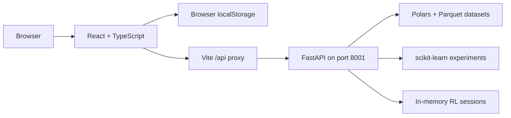

# Sherlock

**A local data and AI studio, from raw datasets to visual analysis and machine learning experiments.**

Sherlock brings workspace management, data preparation, visual pipelines, AutoAI, and AI experimentation into one browser-based application. Inspired by the watsonx studio experience, it combines a React interface with a Python backend for data processing and model training.

Use it to explore a dataset, build a repeatable transformation flow, compare models, or connect a separate reinforcement learning environment. No cloud account or external AI API key is required for the included local workflows.

> Sherlock is a local development/demo project. Some modules run real computation; others intentionally simulate AI services and runtime infrastructure. See [Execution modes](#execution-modes) for the distinction.

---

## Contents

- [What you can do](#what-you-can-do)
- [Quick start](#quick-start)
- [Your first workflow](#your-first-workflow)
- [How it works](#how-it-works)
- [Execution modes](#execution-modes)
- [Configuration](#configuration)
- [Commands and checks](#commands-and-checks)
- [Reinforcement learning](#reinforcement-learning)
- [API reference](#api-reference)
- [Project structure](#project-structure)
- [Troubleshooting](#troubleshooting)
- [Development notes](#development-notes)

## What you can do

| Area | What it is for |
| --- | --- |
| **Workspaces and assets** | Organize datasets, notebooks, scripts, models, and other studio resources. Contextual tabs let you move between tools and assets. |
| **Data Refinery** | Inspect data quality and column profiles, apply preparation steps, and save refined datasets for downstream analysis. |
| **Visualization Canvas** | Connect data sources, transformations, Python nodes, and charts in a visual directed acyclic graph (DAG). |
| **AutoAI** | Explore supervised and unsupervised model training, compare experiment results, and monitor connected RL environments. |
| **Runtime and notebooks** | Organize code and analysis, capture visualization results, and explore simulated execution environments and artifacts. |

**Not implemented yet:** Prompt Lab, RAG Lab, and Agent Lab. These modules are not available as supported workflows.

The application currently includes Portuguese interface text. This README provides the setup and architectural guide in English.

## Quick start

### 1. Prerequisites

- **Git** to clone the repository.
- **Node.js and npm** compatible with the Vite 6 toolchain; Node.js 22 is a practical starting point.
- **Python 3.12** for the backend setup below. The launcher explicitly checks this version on Windows before trying `python`.

### 2. Clone and install the frontend

```sh
git clone https://github.com/AndreNalinChrisostomo/Sherlock.git
cd Sherlock
npm ci
```

### 3. Install the Python backend

Use a virtual environment outside the repository to keep dependencies separate from project files.

**Windows / PowerShell**

```powershell
py -3.12 -m venv ../sherlock-venv
& ../sherlock-venv/Scripts/python.exe -m pip install -r backend/requirements.txt
$env:SHERLOCK_PYTHON = (Resolve-Path ../sherlock-venv/Scripts/python.exe).Path
```

**macOS / Linux**

```sh
python3.12 -m venv ../sherlock-venv
../sherlock-venv/bin/python -m pip install -r backend/requirements.txt
export SHERLOCK_PYTHON="$(cd ../sherlock-venv/bin && pwd)/python"
```

Keep using the same terminal for the next step so the Python selection remains available.

### 4. Start Sherlock

```sh
npm run dev
```

Open the local URL printed by Vite, usually `http://localhost:5173`.

The development configuration launches `backend/autoai_api.py` and forwards frontend requests under `/api` to `http://127.0.0.1:8001`. You do not need to start a second backend manually.

| Local service | Address |
| --- | --- |
| Web interface | The URL printed by Vite |
| Python backend | `http://127.0.0.1:8001` |
| Interactive API documentation | `http://127.0.0.1:8001/docs` |
| AutoAI health endpoint | `http://127.0.0.1:8001/api/autoai/health` |

The launcher manages port **8001** and the committed Windows launcher stops an existing listener before starting the backend. Reserve that port for Sherlock and run one backend instance at a time.

## Your first workflow

1. **Open or create a workspace.** This is the context that groups your assets and experiments.
2. **Upload a delimited dataset.** CSV, TSV, and TXT uploads are staged by the backend. Accepted operational datasets are converted to Parquet.
3. **Inspect it in Data Refinery.** Review column types, missing values, and quality information, then add the preparation steps you need.
4. **Save the refined output.** This creates a data asset that can be reused in subsequent tools.
5. **Build a visualization flow.** Connect the dataset to transformation and chart nodes in the Visualization Canvas. Each node uses the data arriving through its connections.
6. **Explore AutoAI.** Choose a supported learning workflow and, for supervised training, the target column. Run an experiment and inspect the resulting metrics.
7. **Document the analysis.** Use notebooks and visualization imports to keep the narrative and results together.

## How it works



### Frontend

React 19 and TypeScript implement the studio shell, feature views and contextual tabs. Vite serves the application during development and creates the production frontend bundle. Visualization and export dependencies include Three.js, html2canvas, and jsPDF.

### Backend

FastAPI exposes dataset, refinery, visualization, AutoAI, and RL endpoints. Polars handles tabular processing and Parquet storage; NumPy and scikit-learn support numerical work and machine learning.

### Dataset processing

- Operational datasets are limited to **500,000 rows**.
- Larger delimited uploads must become a sampled asset before they can be used operationally.
- Backend-backed refinery profiles, transformations, and visualization calculations use the complete operational dataset.
- Preview ranges limit the rows displayed in the interface; they do not define the dataset used for those calculations.
- Python visualization nodes receive independent Polars frames through `df` and `inputs`; the output `result` must also be a Polars `DataFrame`.

### Persistence

| Location | What it stores | What to remember |
| --- | --- | --- |
| Browser `localStorage` | Studio state and restored tab context | State belongs to that browser origin. Changing the frontend port or clearing browser storage can make the workspace appear different or empty. |
| `.sherlock_datasets/` | Backend dataset files and registry metadata | This directory is ignored by Git. Dataset files are not included when you clone the repository. |
| Backend memory | Active sessions and execution caches, including RL session state | Restarting the backend clears in-memory state. |

## Execution modes

Sherlock combines working local engines with demonstration modules. Model names and runtime labels in the interface do not necessarily mean a corresponding external service is connected.

| Capability | Current execution model |
| --- | --- |
| Dataset ingestion and Data Refinery | Real backend processing with Polars and Parquet. |
| Visualization DAGs and Python nodes | Real backend execution over connected data, with a restricted Python execution scope. |
| Backend AutoAI training | Local scikit-learn training for supported supervised and unsupervised workflows. |
| RL trainer | Local policy updates through the session API; an external environment supplies observations and rewards. |
| Prompt Lab | Not implemented yet. |
| RAG Lab | Not implemented yet. |
| Agent Lab | Not implemented yet. |
| Runtime jobs, terminal, and Git sync | Simulated execution helpers; these do not provision kernels, run a general shell, or publish assets to Git. |

## Configuration

The backend launcher reads these variables from the environment of the process running Vite:

| Variable | Purpose |
| --- | --- |
| `SHERLOCK_PYTHON` | Select the Python executable used to launch the backend. Prefer an absolute path when using a virtual environment. |
| `PYTHON` | Fallback executable override when `SHERLOCK_PYTHON` is unset. |
| `SHERLOCK_PYTHON_ARGS` | Additional whitespace-separated Python launcher arguments, such as `-3.12` when the executable is `py`. |

For example, with dependencies installed into Python 3.12 on Windows:

```powershell
$env:SHERLOCK_PYTHON = "py"
$env:SHERLOCK_PYTHON_ARGS = "-3.12"
npm run dev
```

Leave `SHERLOCK_PYTHON_ARGS` unset when pointing directly to a virtual environment's Python executable. Set these variables in the shell; the launcher reads `process.env` directly.

## Commands and checks

Run commands from the repository root.

| Command | Purpose |
| --- | --- |
| `npm ci` | Install frontend dependencies from the committed lockfile. |
| `npm run dev` | Start the Vite development server and local backend launcher. |
| `npm run build` | Run TypeScript checks and build the frontend into `dist/`. |
| `npm run preview` | Preview the built frontend. This does not start the Python backend or provide a complete production API setup. |
| `npm test` | Run the frontend Vitest suite once. |
| `python -m unittest discover -s backend -p "test_*.py"` | Run backend unit tests with the Python environment containing the backend dependencies. |
| `npm run rl:emulate` | Exercise the RL API lifecycle in-process, including creation, training, policy retrieval, and deletion. Uses `python` from `PATH`. |
| `npm run reset:dev` | Windows helper that stops listeners on ports 5173 and 8001 and restarts development on port 5173. |

If you used the virtual environment setup above, activate it before running commands that use bare `python`:

```powershell
# Windows / PowerShell
& ../sherlock-venv/Scripts/Activate.ps1
```

```sh
# macOS / Linux
source ../sherlock-venv/bin/activate
```

There is no separate lint script; `npm run build` includes the TypeScript check. A production deployment needs its own backend process and API routing in addition to the static frontend files.

## Reinforcement learning

Sherlock separates the **trainer** from the **environment**:

1. An external application owns the environment state and physics.
2. It creates a trainer session associated with a Sherlock workspace.
3. It sends transitions containing `observation`, `action`, `reward`, `nextObservation`, and `done`.
4. The backend updates the policy and returns the next action and training metrics.
5. AutoAI's Adversarial / RL view displays environments associated with that workspace.

Active RL sessions are held in backend memory and reset when that process restarts.

## API reference

For request schemas and interactive examples, open `http://127.0.0.1:8001/docs` while the backend is running.

| Endpoint | Purpose |
| --- | --- |
| `POST /api/datasets/upload` | Stage and ingest a delimited dataset. |
| `POST /api/datasets/{dataset_id}/sample` | Create a sampled operational dataset. |
| `GET /api/datasets/{dataset_id}/preview` | Retrieve a display range from a dataset. |
| `POST /api/datasets/{dataset_id}/refinery/profile` | Compute a dataset profile. |
| `POST /api/datasets/{dataset_id}/refinery/run` | Execute preparation steps and create a refined dataset. |
| `GET /api/autoai/health` | Check AutoAI backend availability. |
| `POST /api/autoai/run` | Run a supported AutoAI experiment. |
| `POST /api/visualization/execute` | Execute a visualization graph. |
| `POST /api/rl/session` | Create a trainer session. |
| `POST /api/rl/session/{session_id}/step` | Submit a transition and update the policy. |
| `POST /api/rl/session/{session_id}/episode` | Record an episode summary. |
| `GET /api/rl/session/{session_id}/policy` | Retrieve the current policy. |
| `GET /api/rl/environments` | List connected environments. |
| `POST /api/rl/models` | Save a policy snapshot from a session. |
| `GET /api/rl/models` | List saved model records. |
| `POST /api/rl/models/{model_id}/action` | Request an action from a saved policy. |
| `DELETE /api/rl/session/{session_id}` | Remove a trainer session. |
| `DELETE /api/rl/environments/{session_id}` | Remove an environment from the monitored list. |

## Project structure

```text
Sherlock/
|-- src/                        React views, domain models, local engines, tests
|   |-- App.tsx                 Studio shell and workspace navigation
|   |-- DataPrepView.tsx        Data Refinery interface
|   |-- VisualizationCanvasView.tsx
|   |-- AutoAiView.tsx          AutoAI and RL interface
|   |-- RuntimeLabView.tsx     Runtime and notebook workflows
|   |-- storage.ts             Browser persistence
|   `-- studioTabs.ts          Contextual tab state
|-- backend/
|   |-- autoai_api.py          FastAPI application and computation engines
|   |-- requirements.txt       Pinned Python dependencies
|   `-- test_*.py              Backend regression tests
|-- scripts/                    Dataset generators and development utilities
|-- docs/                       Additional study documentation
|-- CODEBASE_MAP.md             Detailed architecture and module map
|-- RULEBOOK.md                 Project implementation rules
|-- TODO_GLOBAL.md              Existing task notes
`-- vite.config.js             Frontend server, API proxy, and backend launcher
```

## Troubleshooting

| Symptom | What to check |
| --- | --- |
| The interface opens, but data tools fail | Read the backend output in the Vite terminal. Verify that the selected Python can import `fastapi`, `uvicorn`, `polars`, `numpy`, and `sklearn`. |
| Python dependencies are installed, but imports still fail | Point `SHERLOCK_PYTHON` to the same interpreter used for `-m pip install`. Installing into a different Python environment does not configure the launcher. |
| The browser opens on a different port | Use the exact URL printed by Vite. Browser storage is tied to the origin, including the port. |
| A large upload cannot become an asset | Create the offered sample. Operational assets cannot exceed 500,000 rows. |
| RL environments disappear after a restart | Active sessions are in-memory; recreate them from the environment application. |
| A dataset generator fails to write a file | The generator scripts contain author-specific output paths. Change `outputPath` to an existing local destination before running them. |
| `npm run preview` loads the UI but API calls fail | Preview serves the frontend bundle. Use the development command for the integrated local setup, or configure backend hosting and `/api` routing separately. |

## Development notes

Before changing behavior, read [RULEBOOK.md](RULEBOOK.md) and the [codebase map](CODEBASE_MAP.md). The central data contract is that full operational datasets drive analysis while preview ranges only control display.

Keep changes focused, add regression coverage for meaningful behavior changes, and run the checks relevant to the area you changed. Feature views use PascalCase filenames; helper modules use camelCase; frontend tests live alongside their modules as `*.test.ts`.

This repository does not currently include a license file.
